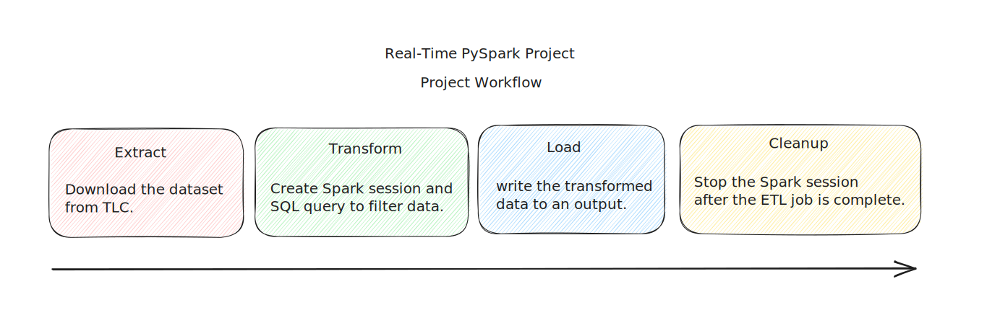

# Real-Time PySpark Project

  

Welcome to the "Real-Time PySpark Project." In this project, we will delve into the fundamentals of PySpark, an open-source distributed data processing and analysis framework. Our goal is to provide you with a solid understanding of PySpark's core concepts and its applications in processing and analyzing large-scale datasets in real-time.

**What is this project ?**
This project introduces PySpark, a powerful open-source framework for distributed data processing. We explore its architecture, components, and applications for real-time data analysis.

**Why did you do it ?**
The project aims to equip you with PySpark skills for efficient data handling in the era of big data. Understanding PySpark empowers you to excel in data-related challenges across industries.

**What are the gains from doing this project ?**
By completing this project, you will achieve the following gains:

 - **Solid Understanding of PySpark:** You will have a clear grasp of PySpark's foundational concepts, enabling you to navigate its features and functionalities effectively.

 - **Awareness of Spark Architecture:** You will gain insights into the underlying architecture of Apache Spark and comprehend how its components work together to process data efficiently.

 - **Practical Data Manipulation Skills:** Through hands-on examples, you will develop practical skills in data manipulation using PySpark's DataFrames and Spark SQL.

 - **Real-Time Analytics Capability:** You will learn how to leverage Spark Streaming for real-time data processing, opening up possibilities for building real-time analytics applications.

 - **Enhanced Data Processing Efficiency:** By understanding Spark's in-memory computations and parallel processing, you will be equipped to handle large-scale datasets efficiently.

 - **Integration with Python Ecosystem:** You will learn how to integrate PySpark seamlessly with popular Python libraries such as NumPy, Pandas, and scikit-learn.

 - **Foundation for Advanced Concepts:** This project serves as a foundation for more advanced PySpark concepts and techniques that you can explore in the future.

## Data Description
Throughout the project, we will work with the [TLC (Taxi and Limousine Commission)](https://www.nyc.gov/site/tlc/about/tlc-trip-record-data.page) Trip Record Data, a dataset containing detailed information about taxi trips in New York City. This dataset provides a real-world context for applying PySpark's capabilities to real-time data analysis.

## Workflow

